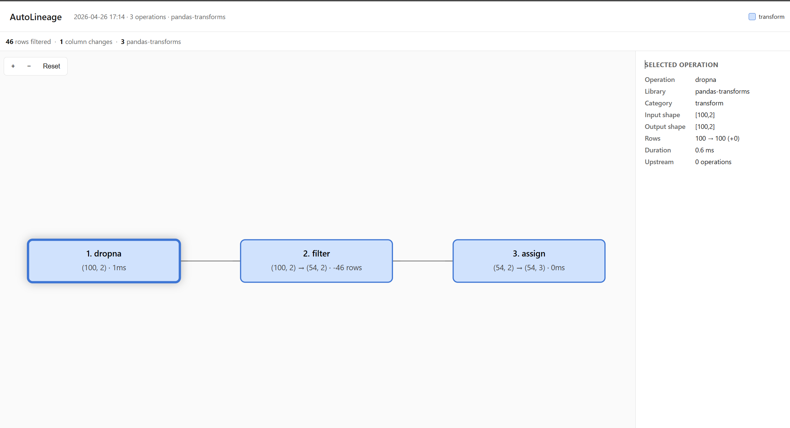
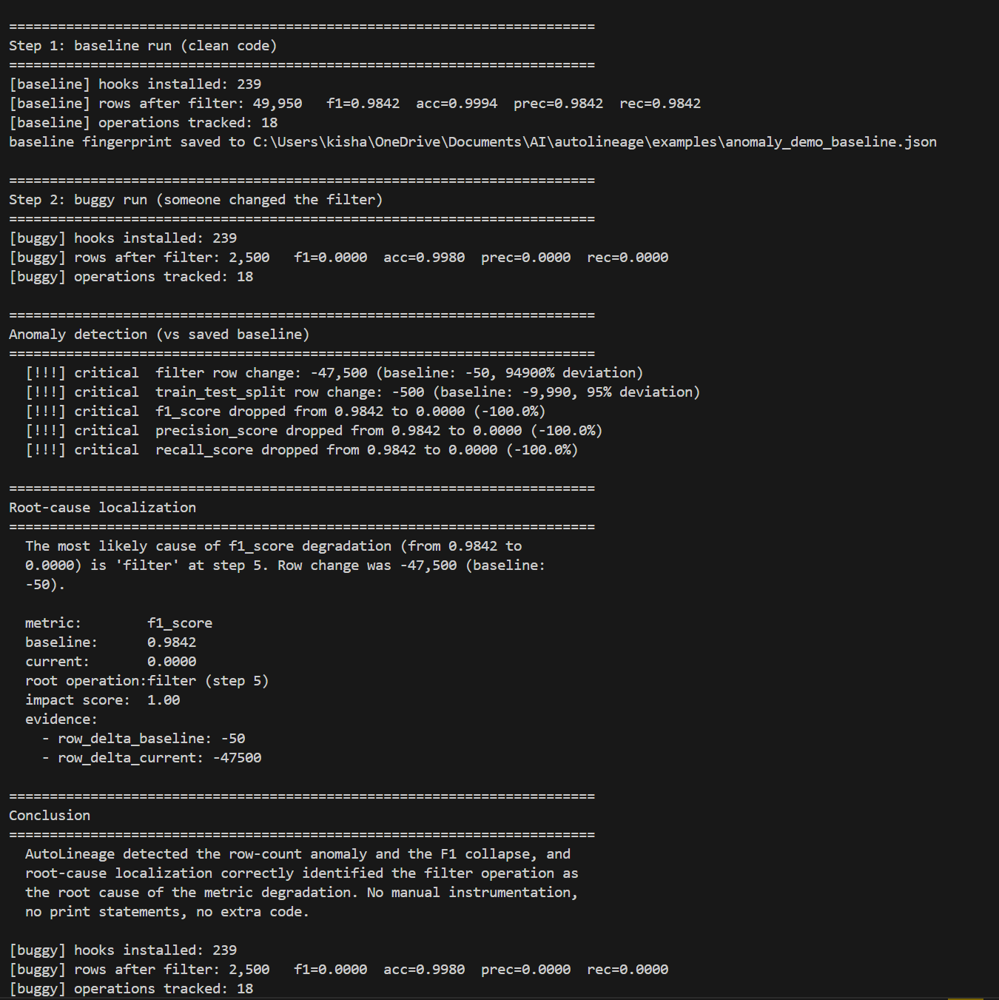

# AutoLineage

**Zero-code data lineage for Python ML pipelines.**

AutoLineage automatically records every DataFrame operation, model training step, and metric evaluation across pandas, scikit-learn, and PySpark, and then detects anomalies and pinpoints root causes when something goes wrong. One `import` activates 288 hooks. No decorators, no wrapper classes, no configuration files.

```python
import autolineage.auto        # that's the whole setup

import pandas as pd
from sklearn.model_selection import train_test_split
from sklearn.ensemble import RandomForestClassifier
from sklearn.metrics import f1_score

df = pd.read_csv("data.csv").dropna()
X = df.drop(columns=['target'])
y = df['target']
X_tr, X_te, y_tr, y_te = train_test_split(X, y, test_size=0.2)

model = RandomForestClassifier().fit(X_tr, y_tr)
preds = model.predict(X_te)
score = f1_score(y_te, preds)

# AutoLineage has tracked every line above into one DAG.
from autolineage.auto import get_tracker
get_tracker().visualize()      # opens an interactive lineage graph
```



Click any node to see operation metadata, shape changes, and upstream dependencies. Export to JSON, Graphviz DOT, Mermaid markup, or self-contained HTML.

---

## Why AutoLineage?

ML pipelines fail silently. A model whose F1 drops from 0.98 to 0.00 invites hours of `print(df.shape)` debugging. Existing tools either require explicit instrumentation (MLflow), track only files (DVC), or cover only a single stage (Evidently, Arize). **No existing tool records the complete path from `read_csv` through `f1_score` in one graph automatically — and then tells you which operation caused a metric to drop.**

AutoLineage closes that gap.

### Compared to other tools

| Capability | AutoLineage | MLflow | Evidently | OpenLineage | DataLineagePy |
|---|---|---|---|---|---|
| Zero code changes | **Yes** | No | No | No | No (wrapper) |
| Operation-level | **Yes** | No | No | Job-level | Yes |
| Cross-framework | **pandas + sklearn + PySpark** | — | — | Spark only | pandas only |
| End-to-end trace | **Yes** | No | No | No | No |
| Anomaly detection | **Yes** | No | Drift only | No | No |
| Root-cause localization | **Yes** | No | No | No | No |
| Interactive visualization | **Yes** | Web UI | Web UI | Web UI | No |

---

## Catching pipeline bugs automatically

This is what AutoLineage is for. Run `python examples/anomaly_demo.py` and watch a single-line filter bug get detected and localized:



The demo runs the same pipeline twice — once cleanly, once with a corrupted filter — and AutoLineage catches the row-count anomaly, the F1 collapse, and identifies the exact line that caused both. No manual instrumentation, no print statements.

---

## Installation

```bash
# Base install (pandas tracking only)
pip install autolineage

# Recommended: include sklearn support (most common ML stack)
pip install autolineage[sklearn]

# Full install with sklearn + pyspark + Jupyter rich output
pip install autolineage[all]
```

> AutoLineage detects which frameworks you have installed and hooks them automatically. The `sklearn` and `pyspark` extras tell pip to install those frameworks alongside AutoLineage if you don't have them already.

---

## Quick Start

### 1. Automatic tracking (one line)

```python
import autolineage.auto         # MUST be the first autolineage line in your script

# Use pandas / sklearn / pyspark normally — every operation is tracked
import pandas as pd
df = pd.read_csv("data.csv").dropna().drop_duplicates()

from autolineage.auto import get_tracker
get_tracker().visualize()       # opens HTML graph in your browser
```

> **Why first?** `import autolineage.auto` patches framework methods at import time. If you write `from sklearn.metrics import f1_score` *before* this line, your local `f1_score` reference will bypass the wrapper. AutoLineage will warn you when this happens, but the easiest fix is to put `import autolineage.auto` at the top of your file.

### 2. Visualize the lineage

```python
tracker = get_tracker()

tracker.visualize()                          # interactive HTML, opens in browser
tracker.visualize("trace.html")              # custom path, no browser pop-up
tracker.to_dot()                             # Graphviz DOT
tracker.to_mermaid()                         # Markdown-friendly Mermaid
```

In Jupyter notebooks, putting the tracker as the last expression in a cell auto-renders a summary table:

```python
get_tracker()  # in a Jupyter cell — produces a rich HTML table inline
```

### 3. Anomaly detection

```python
from autolineage.core.analyzer import LineageAnalyzer

analyzer = LineageAnalyzer(tracker)
analyzer.load_baseline("baseline.json")        # compare against a saved healthy run
anomalies = analyzer.detect_anomalies()

for a in anomalies:
    print(f"[{a.severity}] {a.message}")
# [critical] filter row change: -47,500 (baseline: -50, 94900% deviation)
# [critical] f1_score dropped from 0.9842 to 0.0000 (-100.0%)
```

### 4. Root-cause localization

```python
cause = analyzer.localize_root_cause("f1_score")
print(cause.explanation)
# "The most likely cause of f1_score degradation (from 0.9842 to 0.0000)
#  is 'filter' at step 5. Row change was -47,500 (baseline: -50)."
```

### 5. Save a fingerprint for future comparison

```python
analyzer.save_fingerprint("baseline.json")     # after a healthy run

# Next run, in a different process:
analyzer = LineageAnalyzer(new_tracker)
analyzer.load_baseline("baseline.json")
anomalies = analyzer.detect_anomalies()
```

---

## What Gets Tracked

**pandas (64 hooks):** `read_csv`, `to_csv`, `read_parquet`, `to_parquet`, `dropna`, `fillna`, `merge`, `concat`, `groupby` + aggregations, `drop_duplicates`, boolean filtering, `assign`, `sort_values`, `pivot_table`, `melt`, plus 40+ more.

**scikit-learn (175 hooks):** `train_test_split`, estimator `fit` / `predict` / `predict_proba` / `score` across 30+ classes (RandomForest, LogisticRegression, DecisionTree, SVC, KNN, GradientBoosting, etc.), 18 preprocessor classes, 15 metric functions.

**PySpark (49 hooks):** DataFrame transforms, `groupBy` + aggregations, join variants, reader / writer methods, actions.

See [`autolineage/hooks/`](autolineage/hooks/) for the full list.

---

## Example Output

On a 284K-row credit card fraud detection pipeline (`paper/credit_card_pipeline.py`):

```
 1. [io        ] read_csv -> (284807, 31)                    [1280ms]
 2. [transform ] drop_duplicates (-1,081 rows)                [827ms]
 3. [transform ] filter (-284 rows)
 4. [transform ] assign -> 36 cols                              [1ms]
 5. [transform ] select -> 34 cols
 6. [split     ] train_test_split (80/20)                     [218ms]
 7. [preprocess] StandardScaler.fit_transform                 [201ms]
 8. [preprocess] StandardScaler.transform                      [17ms]
 9. [train     ] RandomForestClassifier.fit                 [88637ms]
10. [train     ] LogisticRegression.fit                      [1138ms]
11. [predict   ] RandomForestClassifier.predict               [332ms]
12. [predict   ] LogisticRegression.predict                     [4ms]
13. [predict   ] RandomForestClassifier.predict_proba         [311ms]
14. [evaluate  ] accuracy_score    = 0.9995
15. [evaluate  ] precision_score   = 0.8824
16. [evaluate  ] recall_score      = 0.7895
17. [evaluate  ] f1_score          = 0.8333
18. [evaluate  ] roc_auc_score     = 0.9871
```

24 clean records. Zero noise. End-to-end trace from CSV to metrics.

---

## Architecture

Plugin-based. Each library is a single file implementing `BaseHookProvider`. Adding new libraries requires ~200 lines and zero changes to the core.

```
   User Code (unchanged)
           |
   Hook Providers (pandas | sklearn | pyspark | ...)
           |
   UnifiedTracker + TransformationRecord
           |
   LineageAnalyzer  →  anomalies, root causes, fingerprints
   Visualizer       →  HTML / DOT / Mermaid / Jupyter
```

---

## Performance

Per-operation instrumentation cost on a 37-operation pipeline (Intel i7-12700H, Python 3.12, pandas 3.0):

| Condition | Mean time per call | 95% CI |
|---|---|---|
| Baseline (no instrumentation) | 263.5 µs | ± 8.8 µs |
| With AutoLineage | 348.2 µs | ± 9.0 µs |
| **Overhead** | **84.7 µs / op** | **[78, 91]** |

At production data scales (≥10⁵ rows), end-to-end overhead becomes indistinguishable from baseline variance because framework computation dominates wall-clock time. See `paper/scaling_results.csv` for the full scaling study.

---

## Limitations

- **Single-process.** Pipelines spanning multiple machines require manual trace correlation. OpenTelemetry export is planned.
- **Monkey-patching is version-sensitive.** Tested against pandas 2.x / 3.x, scikit-learn 1.x, PySpark 3.x / 4.x.
- **Import order matters.** `import autolineage.auto` must come before `from sklearn.metrics import f1_score` (or any other hooked symbol) — otherwise the local reference will bypass the wrapper. AutoLineage will warn you when this happens.
- **C-extension code is invisible.** Operations that execute entirely in compiled code without re-entering Python (e.g., certain numpy reductions) are not captured.
- **Python-only.** R, Julia, Java are out of scope.

---

## Contributing

Add a new library in 5 steps:

1. Create `autolineage/hooks/your_lib_hooks.py`
2. Subclass `BaseHookProvider`
3. Implement `install(tracker)` and `uninstall()`
4. Register in `autolineage/hooks/registry.py`
5. Open a PR

See `autolineage/hooks/pandas_io.py` for the smallest working example (~110 LoC).

---

## Development

```bash
git clone https://github.com/kishanraj41/autolineage
cd autolineage
pip install -e ".[dev]"
pytest tests/                      # 51 tests
python examples/anomaly_demo.py    # full end-to-end demo
```

---

## License

MIT

---

## Citation

If you use AutoLineage in your research, please cite:

```bibtex
@misc{vandhavasi2026autolineage,
  title={AutoLineage: Operation-Level Data Lineage for Python ML Pipelines via Import-Time Hooking},
  author={Vandhavasi, Kishan Raj},
  year={2026},
  eprint={2604.XXXXX},
  archivePrefix={arXiv},
  primaryClass={cs.SE}
}
```
